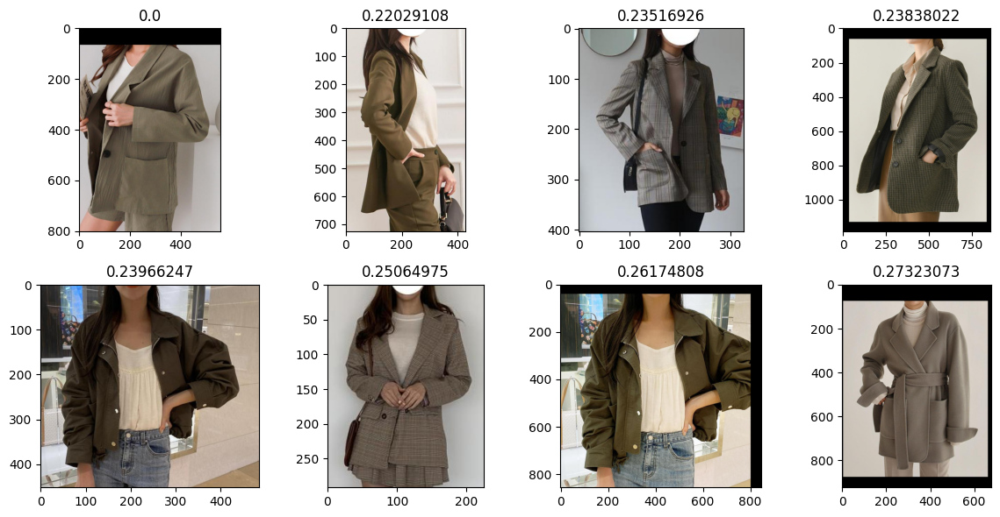

# Similar Fashion Products

A machine learning project for finding similar fashion products using image classification and vector similarity search. This project uses a multi-branch EfficientNet model to classify fashion items by detail category, color, fit, and length, and employs FAISS for efficient vector similarity search to find matching products.

## Features

- **Image Classification**: Classify fashion images into multiple categories (detail, color, fit, length) using a branched neural network.
- **Vector Similarity Search**: Extract image features and perform fast similarity search using FAISS indexing.
- **Flask Web API**: Two Flask applications for prediction and matching services.
- **Dimensionality Reduction**: Uses PCA for feature compression to optimize search performance.

## Installation

1. Clone the repository:
   ```bash
   git clone <repository-url>
   cd similar_fashion_products
   ```

2. Install dependencies:
   ```bash
   pip install -r requirements.txt
   ```

3. Ensure you have the pre-trained model and indices in the appropriate directories:
   - `train_results/best_model.pth`
   - `train_results/*.json` (category lists)
   - `index/*.index` (FAISS indices)
   - `vectors/pca_model.pkl`

## Usage

### Running the Notebooks

The project includes Jupyter notebooks for model training, loading, and vector searching:

- `model.ipynb`: Model training and evaluation
- `loading_model_with_flask.ipynb`: Loading the model with Flask integration
- `vector_searching.ipynb`: Demonstrating vector similarity search

Run the notebooks in a Jupyter environment (e.g., Google Colab or local Jupyter).

### Running the Flask Apps

#### Prediction App (`part3_chapter03_app/app.py`)

This app provides image classification.

```bash
cd part3_chapter03_app
python app.py
```

Send a POST request to `http://localhost:5000/predict` with an image file.

#### Matching App (`part3_chapter03_app/matching_app.py`)

This app provides similarity matching.

```bash
cd part3_chapter03_app
python matching_app.py
```

Send a POST request to `http://localhost:5000/predict` with an image file to get similar products.

## Screenshots

Here are some example outputs from the project:

### Vector Similarity Search Results


*Example of similar fashion products found using vector search.*

## API Endpoints

### Prediction App

- `POST /predict`: Upload an image to get classification and feature vector.
  - Input: Image file
  - Output: JSON with `predicted_class_index` and `feature`

### Matching App

- `POST /predict`: Upload an image to find similar products.
  - Input: Image file
  - Output: JSON with `distances` and `matched_files`

## Project Structure

```
similar_fashion_products/
├── model.ipynb                    # Model training notebook
├── loading_model_with_flask.ipynb # Model loading with Flask
├── vector_searching.ipynb         # Vector search demonstration
├── requirements.txt               # Python dependencies
├── README.md                      # Project documentation
├── images/                        # Screenshots and example images
├── part3_chapter03_app/
│   ├── app.py                     # Classification Flask app
│   └── matching_app.py            # Matching Flask app
├── train_results/
│   ├── best_model.pth             # Trained model weights
│   ├── annotations.json           # Training annotations
│   └── *.json                     # Category lists
├── index/
│   ├── *.index                    # FAISS indices
│   └── image_path_id_list.json    # Image mappings
└── vectors/
    └── feature_map.json           # Feature mappings
```

## Model Architecture

The model uses EfficientNet-B0 as the backbone with 4 branches for multi-task classification:
- Detail Category
- Color
- Fit
- Length

Features are extracted and used for similarity search after PCA dimensionality reduction.

## Contributing

1. Fork the repository
2. Create a feature branch
3. Make your changes
4. Test thoroughly
5. Submit a pull request