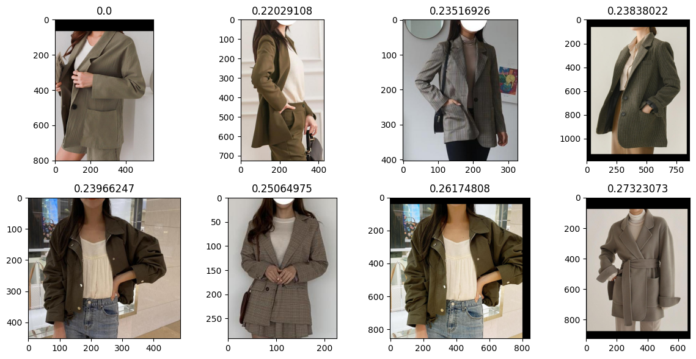

# Similar Fashion Products

> Find visually similar fashion items using multi-task image classification and FAISS vector similarity search.


---

## Overview

This project trains a **multi-branch EfficientNet-B0** model to classify fashion images across four attributes simultaneously, then uses those learned feature embeddings for fast nearest-neighbour retrieval via **FAISS**.

```
Input Image
    │
    ▼
EfficientNet-B0 Backbone  ──► 1280-dim feature vector
    │                               │
    ▼                               ▼
4 Classification Branches     L2 Normalize → PCA (128-dim) → FAISS Search
  ├── Detail Category                                              │
  ├── Color                                                        ▼
  ├── Fit                                               Top-K Similar Products
  └── Length
```

---

## Features

| Feature | Description |
|---|---|
| Multi-task classification | Predicts detail, color, fit, and length in one forward pass |
| Vector similarity search | FAISS-powered ANN search over extracted embeddings |
| Dimensionality reduction | PCA compresses 1280-dim → 128-dim for faster search |
| REST API | Two Flask apps — one for classification, one for matching |
| Multiple index types | Flat, IVF, and HNSW indices included |

---

## Prerequisites

- Python **3.8+**
- (Optional) CUDA-compatible GPU — the model falls back to CPU automatically

---

## Installation

```bash
# 1. Clone the repository
git clone <repository-url>
cd similar_fashion_products

# 2. Install dependencies
pip install -r requirements.txt
```

### Required Files

Before running the apps, make sure the following pre-trained artifacts are present:

```
train_results/
├── best_model.pth              # Trained EfficientNet weights
├── detail_category_list.json   # Detail category labels
├── color_list.json             # Color labels
├── fit_list.json               # Fit labels
└── length_list.json            # Length labels

index/
├── flat_index.index            # Brute-force FAISS index
├── ivf_index.index             # Inverted File index (default for matching)
├── hnsw_index.index            # Hierarchical NSW index
└── image_path_id_list.json     # Maps index IDs → image file paths

vectors/
└── pca_model.pkl               # Fitted PCA model (1280 → 128 dims)
```

> **Note:** The Flask apps currently use hardcoded Google Drive paths (`/content/drive/MyDrive/...`). Update `model_save_dir`, `index_save_dir`, and `vector_save_dir` in both `app.py` and `matching_app.py` to point to your local directories before running locally.

---

## Usage

### Notebooks

Run these in order in Google Colab or a local Jupyter environment:

| Notebook | Purpose |
|---|---|
| `model.ipynb` | Train the multi-branch EfficientNet model |
| `loading_model_with_flask.ipynb` | Load the saved model and serve it via Flask |
| `vector_searching.ipynb` | Build FAISS indices and demo similarity search |

### Flask Apps

#### Classification App — `app.py`

Classifies an uploaded image into detail/color/fit/length categories and returns the raw feature vector.

```bash
cd part3_chapter03_app
python app.py
# Runs on http://localhost:5000
```

**Example request:**
```bash
curl -X POST http://localhost:5000/predict \
  -F "file=@/path/to/image.jpg"
```

**Example response:**
```json
{
  "predicted_class_index": 3,
  "feature": [0.021, -0.134, 0.087, "..."]
}
```

---

#### Matching App — `matching_app.py`

Returns the top-8 most visually similar products from the indexed catalogue.

```bash
cd part3_chapter03_app
python matching_app.py
# Runs on http://localhost:5000
```

**Example request:**
```bash
curl -X POST http://localhost:5000/predict \
  -F "file=@/path/to/image.jpg"
```

**Example response:**
```json
{
  "distances": [0.012, 0.034, 0.056, 0.078, 0.091, 0.103, 0.115, 0.127],
  "matched_files": [
    "images/top_001.jpg",
    "images/top_042.jpg",
    "..."
  ]
}
```

---

## FAISS Index Comparison

Three index types are pre-built. The matching app uses **IVF** by default.

| Index | Speed | Accuracy | Memory | Best For |
|---|---|---|---|---|
| `flat_index.index` | Slow | Exact | Low | Ground-truth benchmarking |
| `ivf_index.index` | Fast | Near-exact | Low | Production default |
| `hnsw_index.index` | Very fast | Near-exact | High | Latency-critical serving |

To switch index types, change the filename in `matching_app.py`:
```python
index = faiss.read_index(os.path.join(index_save_dir, 'hnsw_index.index'))
```

---

## Model Architecture

```
BranchClassifier
├── Backbone: EfficientNet-B0 (timm)  →  1280-dim feature vector
└── Branches (×4):
    └── Linear(1280, 256) → SiLU → Dropout(0.3) → Linear(256, num_classes)
        ├── Branch 0: Detail Category  (N classes)
        ├── Branch 1: Color            (N classes)
        ├── Branch 2: Fit              (N classes)
        └── Branch 3: Length           (N classes)
```

**Inference pipeline (matching):**
1. Resize image to 224×224 (aspect-preserving pad)
2. Normalize with ImageNet statistics
3. Extract 1280-dim backbone features
4. L2-normalize → PCA → 128-dim compressed vector
5. FAISS `index.search(query, k=8)` → top-8 nearest neighbours

---

## Project Structure

```
similar_fashion_products/
├── model.ipynb                     # Model training & evaluation
├── loading_model_with_flask.ipynb  # Flask integration demo
├── vector_searching.ipynb          # FAISS index building & search demo
├── requirements.txt
├── README.md
├── images/
│   └── similarity_search.png       # Example output
├── part3_chapter03_app/
│   ├── app.py                      # Classification API
│   ├── matching_app.py             # Similarity matching API
│   └── test_image.jpg
├── train_results/
│   ├── best_model.pth
│   ├── annotations.json
│   └── *.json                      # Category label lists
├── index/
│   ├── *.index                     # FAISS indices
│   └── image_path_id_list.json
└── vectors/
    ├── feature_map.json
    └── pca_model.pkl
```

---

## Example Output

### Vector Similarity Search Results



*Top-8 similar fashion products retrieved for a query image.*

---

## Contributing

1. Fork the repository
2. Create a feature branch (`git checkout -b feature/my-feature`)
3. Commit your changes (`git commit -m 'Add my feature'`)
4. Push to the branch (`git push origin feature/my-feature`)
5. Open a pull request
